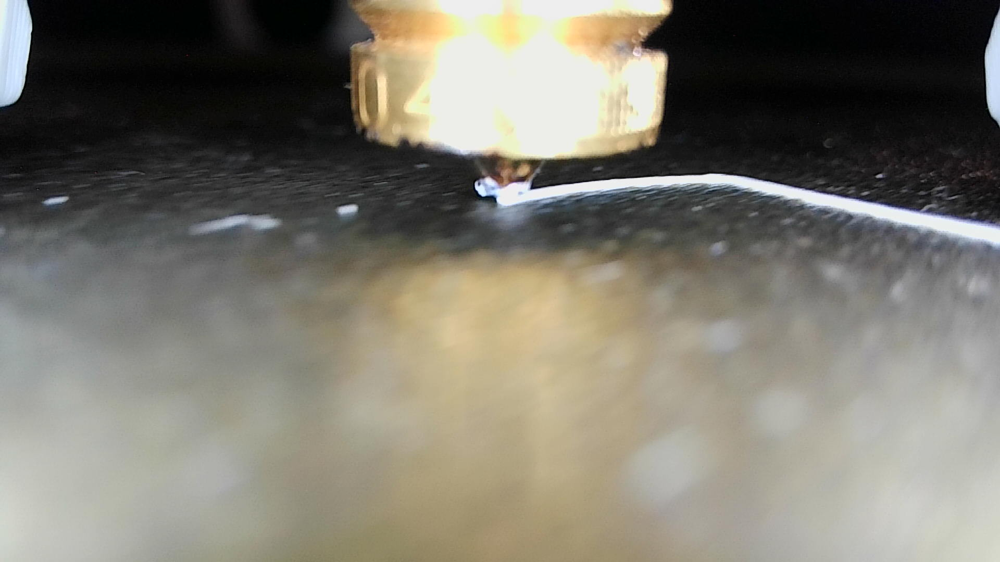
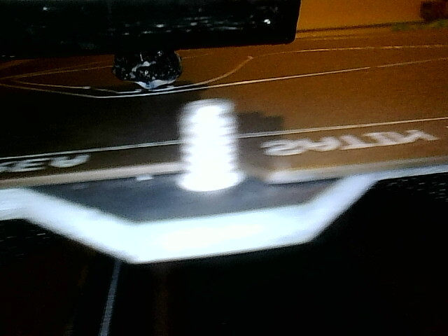

# Extrusion-in-3D-Printer-Images

This repository contains the code and the trained model for detecting issues in 3D printing processes using a custom Vision Transformer (ViT). The project is based on a Kaggle competition aimed at early detection of under-extrusion issues in 3D printed objects, utilizing images taken by a nozzle-mounted camera.

## Background on 3D Printing Challenges

3D printing is an innovative technology capable of creating complex geometric objects. However, the process is prone to certain errors such as under-extrusion. This occurs when the printer fails to supply sufficient material, which can significantly impact the quality and structural integrity of the printed object. The goal of this project is to identify such issues early in the printing process by analyzing images captured during printing.

## About the Competition

The competition challenges participants to build a machine learning model that can predict under-extrusion based on close-up pictures taken by the printer's nozzle camera. This task is crucial for improving the quality control processes in 3D printing.

## Train and Test Files

csvs/train.csv - The training data set
csvs/test.csv - The test data set

## Dataset Overview

- **Images from 7 Different 3D Printers**: Each printer contributes multiple prints, with each print consisting of a series of snapshots taken every 0.5 seconds.
- **Binary Classification**: Each image is labeled either as good print or with under-extrusion, making it a binary classification problem with a focus on anomaly detection.

The dataset consists of images collected from various 3D printers, each identified by unique IDs and labeled for the presence of under-extrusion. Below is a detailed description of each field in the dataset:

- **img_path**: Path to the snapshot of the 3D print. This is used to load the image for processing.

- **printer_id**: The ID of the 3D printer that produced the print. All snapshots with the same printer_id are from the same printer. This field can be useful for identifying model overfitting to specific printers during training. However, it is crucial not to use this field in testing to ensure the model's generalizability across different printers.

- **print_id**: The ID of the print job. All images with the same print_id come from the same print job, which may consist of multiple snapshots. Similar to `printer_id`, this can be used to control for overfitting during model training but should not be used in the testing phase.

- **has_under_extrusion**: A binary label indicating the presence of under-extrusion in the snapshot.
  - `1`: Under extrusion is present. The image shows defects such as incomplete layers or inadequate filament deposition.
  - `0`: Under extrusion is not present. The image shows a good print with no visible defects.

### Note on Using Printer and Print IDs

While the `printer_id` and `print_id` can be instrumental in developing a robust model by controlling for variance during training, they are highly correlated with the conditions under which the prints were produced. As such, these fields are restricted from use in the final testing phase to ensure the model's ability to generalize across unseen printers and prints.

### Visual Examples

To aid in understanding the types of issues this project addresses, below are examples of images with and without under-extrusion:



*Good Print Example: An image showing a print without under-extrusion.*



*Under Extrusion Example: An image showing signs of under extrusion as described.*


### Evaluation Metric

The primary metric for model evaluation is the F1 score, which is suitable for datasets with imbalanced classes as it balances precision and recall.

## Repository Structure

- `extrusion_in_3d_printer_images.py`: Script for training, validating, and testing the model.
- `custom_dataset.py`: Contains custom dataset classes for training and testing.
- Model weights and sample images can be accessed via this [Google Drive link]

## Getting Started

### Dependencies

- Python 3.8+
- PyTorch 1.7+
- torchvision
- PIL
- tqdm
- pandas
- scikit-learn

### Installation

Install the required libraries using pip:

```bash
pip install torch torchvision pandas tqdm pillow scikit-learn
```

## Usage

### Data Preparation

Data can be downloaded using this command:

```bash
kaggle competitions download -c early-detection-of-3d-printing-issues
```

Ensure your data is in a CSV format with columns for img_path and has_under_extrusion, along with any other necessary identifiers which should be removed before training.

### Training the Model

Run the train_val_test.py script to start training and validation:

```bash
python extrusion_in_3d_printer_images.py
```

This script will perform the following actions:

Load and preprocess the data.
Split the data into training, validation, and testing sets.
Define and train the custom Vision Transformer model.
Validate and save the best model based on validation accuracy.
Test the model with the test dataset and save predictions.

### Custom Dataset
The CustomDataset and CustomDatasetTest classes in custom_dataset.py are used to handle loading and transforming images for training and testing purposes. These classes are utilized by the DataLoader during the training process.

### Features
Custom Vision Transformer (ViT) Model: Integrates a pretrained ViT model with custom fully connected layers for specialized tasks.
Data Augmentation: Applies transformations such as random rotations and crops to enhance model generalizability.
Performance Metrics: Evaluates model performance using accuracy and F1-score.

## Output
The test predictions are saved in a CSV file named test_preds.csv, and a final submission file submission_7.csv is prepared for further analysis or competition submission.

This link contains the code and the trained model (.pth file) for this task using a Vision Transformer

https://drive.google.com/drive/folders/1AlkKkih9dm3HKUhCOkCRjjyKlQCSmYez?usp=share_link


### Contributing
Contributions to this project are welcome. Please fork the repository and submit a pull request with your suggested changes.

